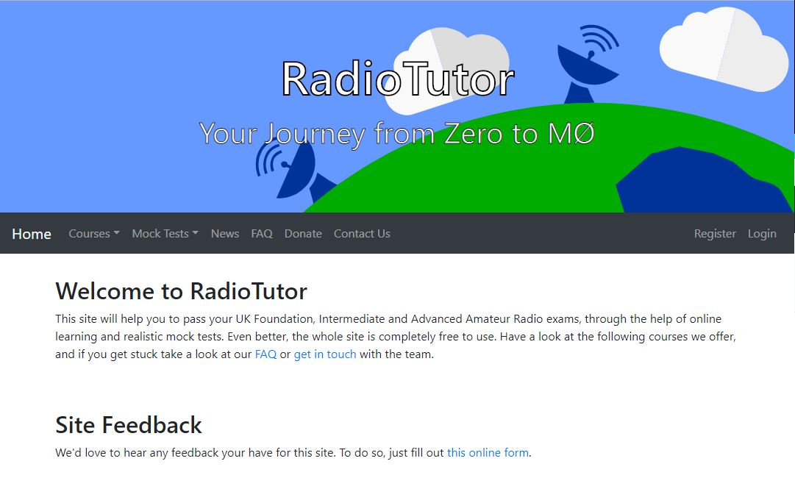
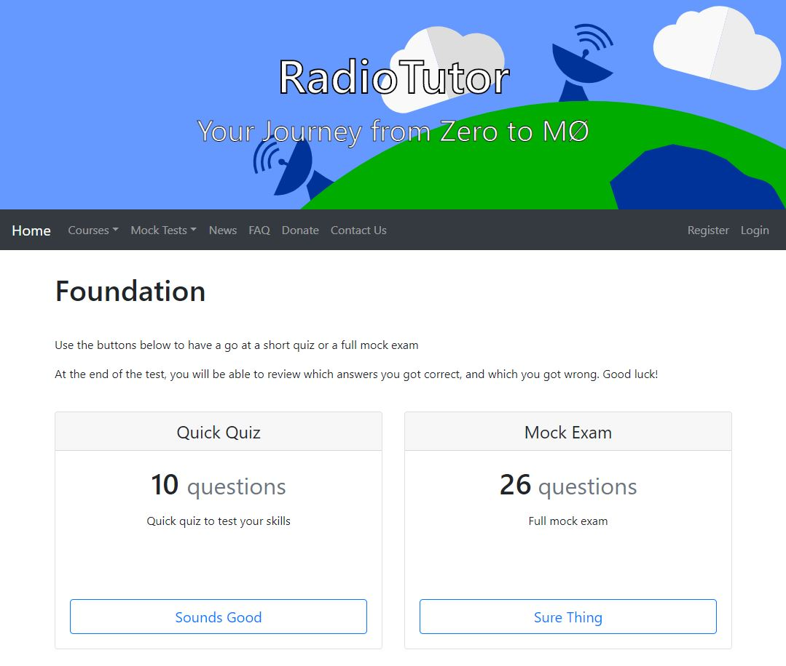
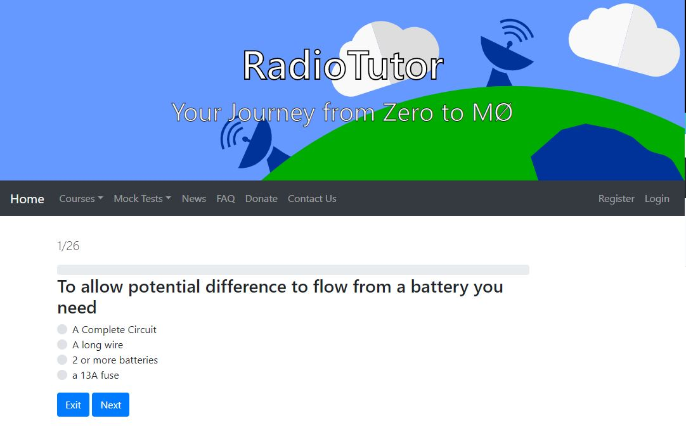
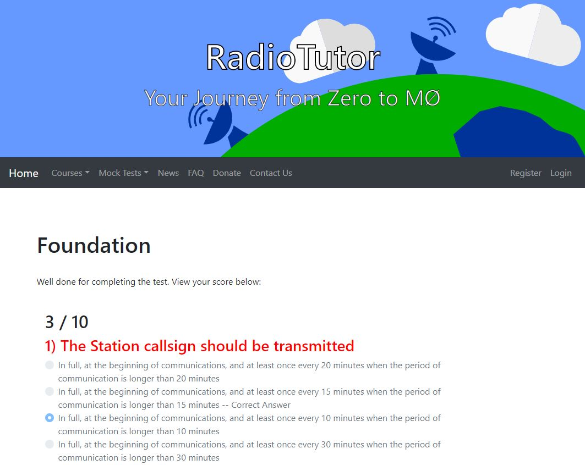

# WIP - Not Up To Date

# Table of Contents

- [Introduction](https://github.com/radiotutor/radiotutor/#introduction)
	- [What is it?](https://github.com/radiotutor/radiotutor/#what-is-it)
	- [What can it do?](https://github.com/radiotutor/radiotutor/#what-can-it-do)
	- [What does it look like?](https://github.com/radiotutor/radiotutor/#what-does-it-look-like)
	- [Is it safe?](https://github.com/radiotutor/radiotutor/#is-it-safe)
- [Requirements](https://github.com/radiotutor/radiotutor/#requirements)
- [Roadmap](https://github.com/radiotutor/radiotutor/#roadmap)
- [Installation](https://github.com/radiotutor/radiotutor/#development-environment)

# Introduction

### What is it?
RadioTutor provides free, online mock tests to help students prepare for UK Amateur Radio exams.

[visit us](https://radiotutor.uk)

### What can it do?
- Generate mock tests for Foundation, Intermediate and Advanced Amateur Radio exams
- Acts as a training hub: linking to other training resources

### What does it look like?

#### Frontend

#### Test Pages

#### Test

#### Results

### Is it safe?
We strive to ensure that Radiotutor is as safe as possible. To do this, we use HTTPS as standard, and hash and salt user passwords using industry standard methods.

# Requirements
Linux box with Go environment installed. Our release instance is running on Amazon Linux AMI. For development, check out [Vagrant](https://www.vagrantup.com/)

# Roadmap

- ~~Mock Test Functionality~~
- ~~User Accounts~~
- New Quiz API
- Integration of 2019 syllabus questions
- Rework frontend
- Additional user account functionality
- Course Structure
- [Feature Requests](https://github.com/radiotutor/radiotutor/issues)

# Development Environment

WIP

TL;DR, use the Gatsby quick start guide

__That's It! Congratulations__
